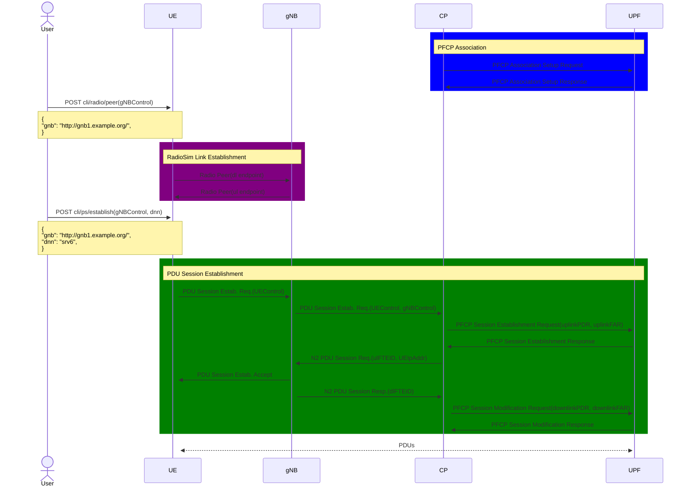

# NextMN Lite

## PDU Session Establishment procedure

```mermaid
%%{init: { 'sequence': {'noteAlign': 'left'} }}%%
sequenceDiagram
actor User
participant UE
participant gNB
participant CP
participant UPF
rect blue
    note over CP,UPF: PFCP Association
    CP->>+UPF: PFCP Association Setup Request
    UPF->>+CP: PFCP Association Setup Response
end
User->>+UE: POST cli/radio/peer(gNBControl)
note over User,UE: {<br>"gnb": "http://gnb1.example.org/",<br>}
rect purple
    note over UE, gNB: RadioSim Link Establishment
    UE->>+gNB: Radio Peer(dl endpoint)
    gNB->>+UE: Radio Peer(ul endpoint)
end
User->>+UE: POST cli/ps/establish(gNBControl, dnn)
note over User,UE: {<br>"gnb": "http://gnb1.example.org/",<br>"dnn": "srv6",<br>}
rect green
    note over UE,UPF: PDU Session Establishment
    UE->>+gNB: PDU Session Estab. Req.(UEControl)
    gNB->>+CP: PDU Session Estab. Req.(UEControl, gNBControl)
    CP->>+UPF: PFCP Session Establishment Request(uplinkPDR, uplinkFAR)
    UPF->>+CP: PFCP Session Establishment Response
    CP->>+gNB: N2 PDU Session Req.(ulFTEID, UEIpAddr)
    gNB->>+UE: PDU Session Estab. Accept
    gNB->>+CP: N2 PDU Session Resp.(dlFTEID)
    CP->>+UPF: PFCP Session Modification Request(downlinkPDR, downlinkFAR)
    UPF->>+CP: PFCP Session Modification Response
end
UE<<-->>+UPF: PDUs
```

## N2 Handover
