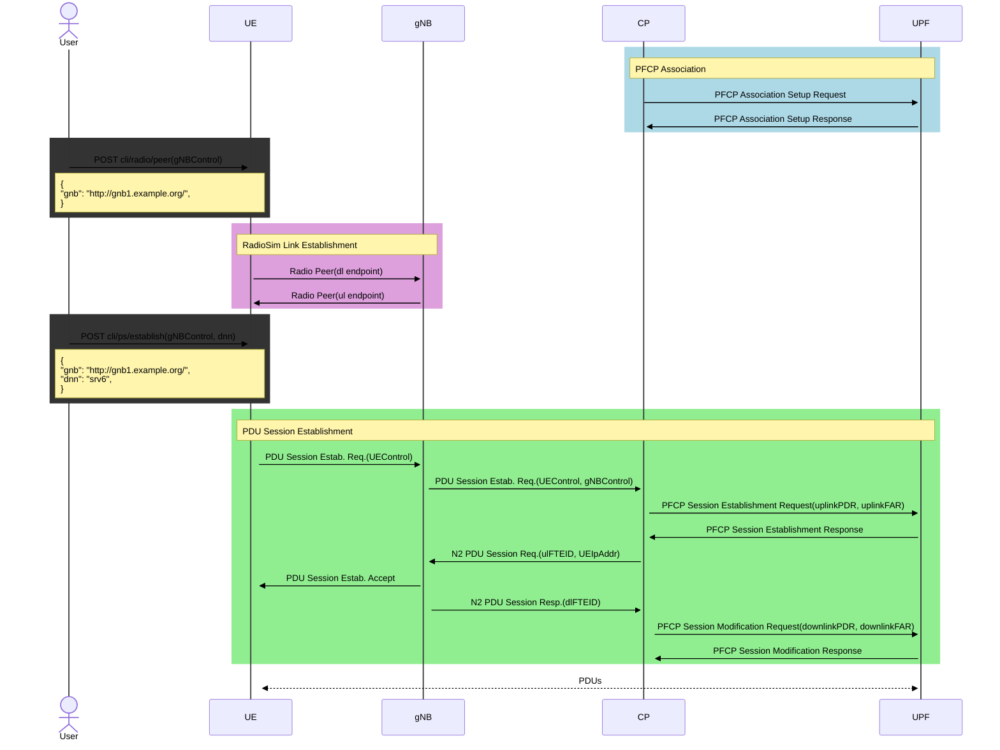
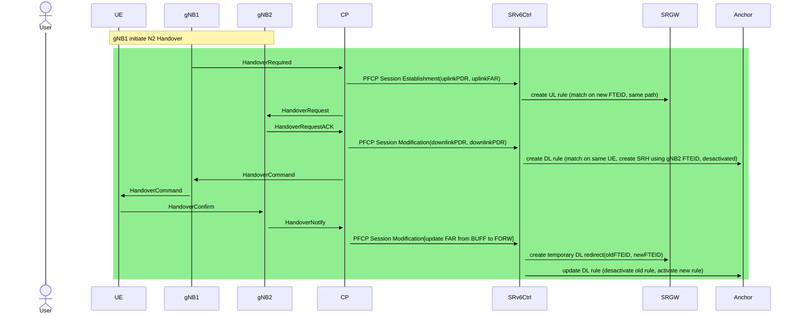
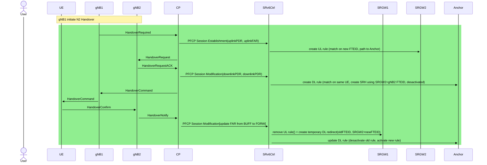
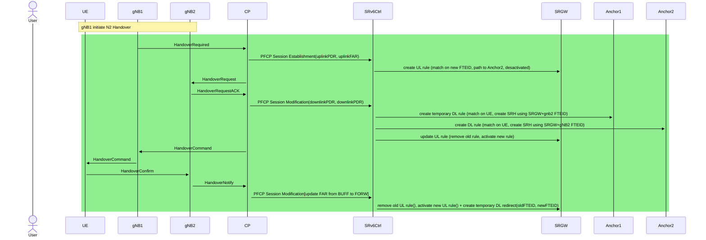
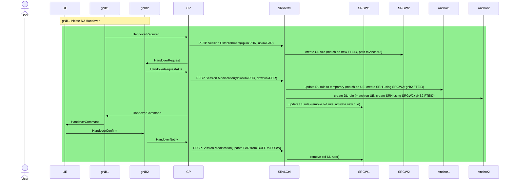

# NextMN Lite

## PDU Session Establishment procedure

## N2 Handover Scenario 1 (preserve SRGW, preserve Anchor)

## N2 Handover Scenario 2 (SRGW update, preserve Anchor)

## N2 Handover Scenario 3 (preserve SRGW, Anchor update)

## N2 Handover Scenario 4 (SRGW update, Anchor update)

