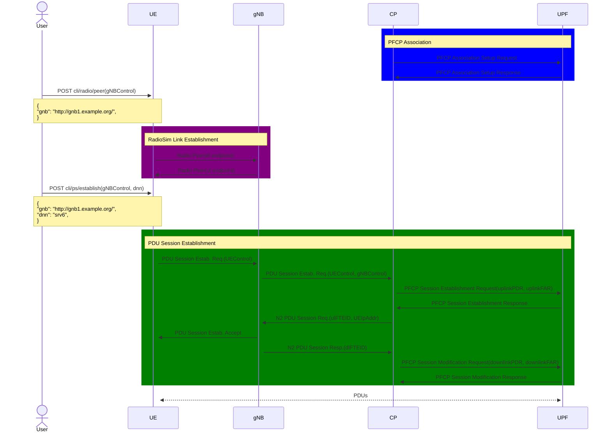
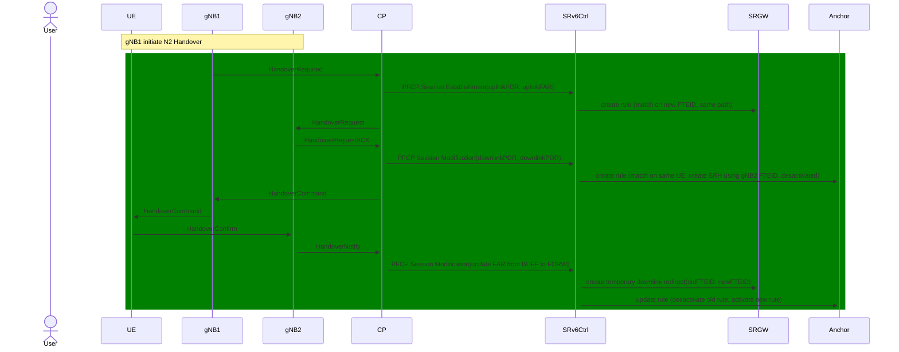

# NextMN Lite

## PDU Session Establishment procedure

```mermaid
%%{init: { 'sequence': {'noteAlign': 'left'} }}%%
sequenceDiagram
actor User
participant UE
participant gNB
participant CP
participant UPF
rect blue
    note over CP,UPF: PFCP Association
    CP->>+UPF: PFCP Association Setup Request
    UPF->>+CP: PFCP Association Setup Response
end
User->>+UE: POST cli/radio/peer(gNBControl)
note over User,UE: {<br>"gnb": "http://gnb1.example.org/",<br>}
rect purple
    note over UE, gNB: RadioSim Link Establishment
    UE->>+gNB: Radio Peer(dl endpoint)
    gNB->>+UE: Radio Peer(ul endpoint)
end
User->>+UE: POST cli/ps/establish(gNBControl, dnn)
note over User,UE: {<br>"gnb": "http://gnb1.example.org/",<br>"dnn": "srv6",<br>}
rect green
    note over UE,UPF: PDU Session Establishment
    UE->>+gNB: PDU Session Estab. Req.(UEControl)
    gNB->>+CP: PDU Session Estab. Req.(UEControl, gNBControl)
    CP->>+UPF: PFCP Session Establishment Request(uplinkPDR, uplinkFAR)
    UPF->>+CP: PFCP Session Establishment Response
    CP->>+gNB: N2 PDU Session Req.(ulFTEID, UEIpAddr)
    gNB->>+UE: PDU Session Estab. Accept
    gNB->>+CP: N2 PDU Session Resp.(dlFTEID)
    CP->>+UPF: PFCP Session Modification Request(downlinkPDR, downlinkFAR)
    UPF->>+CP: PFCP Session Modification Response
end
UE<<-->>+UPF: PDUs
```

## N2 Handover Scenario 1 (single SRGW, preserve Anchor)

```mermaid
%%{init: { 'sequence': {'noteAlign': 'left'} }}%%
sequenceDiagram
actor User
participant UE
participant gNB1
participant gNB2
participant CP
participant SRv6Ctrl
participant SRGW
participant Anchor

note over UE, gNB2: gNB1 initiate N2 Handover
rect green
    gNB1->>+CP: HandoverRequired
    CP->>+SRv6Ctrl: PFCP Session Establishment(uplinkPDR, uplinkFAR)
    SRv6Ctrl->>+SRGW: create rule (match on new FTEID, same path)
    CP->>+gNB2: HandoverRequest
    gNB2->>+CP: HandoverRequestACK
    CP->>+SRv6Ctrl: PFCP Session Modification(downlinkPDR, downlinkPDR)
    SRv6Ctrl->>+Anchor: create rule (match on same UE, create SRH using gNB2 FTEID, desactivated)
    CP->>+gNB1: HandoverCommand
    gNB1->>+UE: HandoverCommand
    UE->>+gNB2: HandoverConfirm
    gNB2->>+CP: HandoverNotify
    CP->>+SRv6Ctrl: PFCP Session Modification[update FAR from BUFF to FORW]
    SRv6Ctrl->>+SRGW: create temporary downlink redirect(oldFTEID, newFTEID)
    SRv6Ctrl->>+Anchor: update rule (desactivate old rule, activate new rule)
end
```
